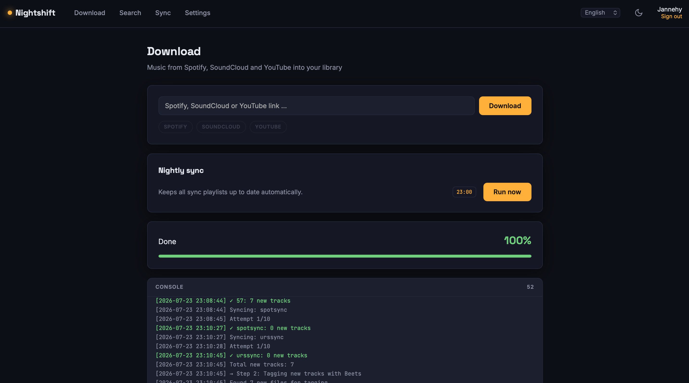
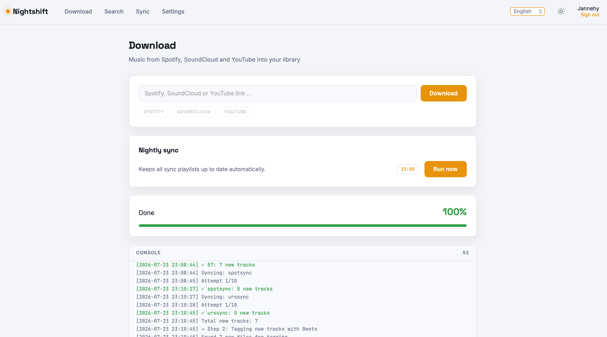

# Nightshift

**Your music library's night shift.** A self-hosted web UI that pulls music from
Spotify, SoundCloud and YouTube into your local library — tagged, organized,
playlist-ready, and kept up to date automatically every night.

Built to sit next to [Navidrome](https://www.navidrome.org/),
[Jellyfin](https://jellyfin.org/) or any other media server that reads a plain
folder of audio files.

## Screenshots





## Features

- **Three sources, one box** – paste a Spotify, SoundCloud or YouTube link;
  Nightshift picks the right pipeline (spotDL or yt-dlp) automatically
- **Sync playlists** – mark a playlist once and the built-in nightly job keeps
  it up to date, working through large playlists across multiple nights when
  rate limits bite
- **Search & download** – find tracks and albums via the iTunes catalog,
  preview them, download with one click
- **Playlist files included** – m3u8 files are written automatically so your
  media server picks playlists up instantly
- **Tagging built in** – optional [beets](https://beets.io/) integration
  imports and tags new files
- **Navidrome integration (optional)** – downloaded playlists can be made
  public or assigned to a specific Navidrome user
- **Multi-user** – admin and regular accounts; only admins see settings
- **Setup wizard** – first run walks you through admin account, library path
  and options; no config file editing required
- **Native apps for iOS and Android** – same server, same API, no extra setup
- **Day & night shift** – full light/dark theme, UI in seven languages

## Apps

Nightshift's web UI works fine on a phone, but there are native clients too.
Both talk to the same API as the browser does — nothing to enable on the server,
though **1.3 or newer** is worth having: from that release the download log is
kept per user, so two people no longer watch each other's runs.

| | |
|---|---|
| [**Nightshift for iOS**](https://github.com/Jannehy/nightshift-ios) | SwiftUI, iOS 16+. Installed through AltStore or SideStore — Apple does not allow this kind of app in the App Store |
| [**Nightshift for Android**](https://github.com/Jannehy/nightshift-android) | Jetpack Compose, Android 8+. Installed from the APK on its releases page |

Both give you the download box with its live log, the iTunes search with
previews, the sync playlists, the nightly job, and the full server settings —
in German and English.

## Quick start (Docker, recommended)

```yaml
# docker-compose.yml
services:
  nightshift:
    image: ghcr.io/jannehy/nightshift:latest   # or build: .
    container_name: nightshift
    ports:
      - "8765:8765"
    volumes:
      - ./config:/config          # config, cookies, sync registry, logs
      - /path/to/your/music:/music
    environment:
      - PUID=1000
      - PGID=1000
      - TZ=Europe/Berlin          # nightly sync runs in this timezone
    restart: unless-stopped
```

```bash
docker compose up -d
```

Open `http://your-server:8765` and follow the setup wizard.

The image bundles everything the pipelines need: **ffmpeg**, **yt-dlp**,
**deno** (required for some YouTube downloads), **spotDL** and **beets** —
one consistent toolchain, no version drift between components.

`/music` is intentionally **not** chown'd recursively on start. Make sure the
host folder is writable for the `PUID`/`PGID` you set.

**Changing the library location:** inside the container the library always
lives at `/music`. To point Nightshift at a different folder, change the
volume mapping in `docker-compose.yml` (`/your/path:/music`) and restart —
not the path in the settings page, which refers to the container's own
filesystem.

## Bare-metal install

Nightshift is a normal Python application, so running it directly works too:

```bash
# System dependencies (Debian/Ubuntu)
sudo apt install ffmpeg python3-pip

# deno – needed for some YouTube downloads
curl -fsSL https://deno.land/install.sh | sh   # ensure it ends up in PATH

git clone https://github.com/Jannehy/nightshift.git
cd nightshift
pip install -r requirements.txt

# Point Nightshift at a config location and start
export NIGHTSHIFT_CONFIG=/etc/nightshift/config.yaml
python -m nightshift
```

The setup wizard runs on first launch, same as in Docker. Nightshift ships
with a production WSGI server (waitress) built in — no extra setup needed. For a permanent
installation, wrap the last two lines in a systemd service.

> **Note:** `deno` must be reachable in the PATH of the *process running
> Nightshift* (this matters for systemd services and cron-like setups — it is
> the single most common cause of YouTube downloads failing with
> "Requested format is not available"). yt-dlp uses it to solve YouTube's JS
> challenge.

> **yt-dlp is pinned to a nightly build** in `requirements.txt`. YouTube
> changes faster than the stable channel is released: with the stable version
> current at the time of writing, every download failed with HTTP 403 or
> "Requested format is not available". If downloads start failing that way
> again, raise the pin:
>
> ```bash
> pip index versions yt-dlp --pre | head -1
> ```

## Configuration

Everything lives in one file: `config.yaml` (in Docker: `/config/config.yaml`).
The setup wizard creates it; the admin settings page edits it. See
[`config/config.example.yaml`](config/config.example.yaml) for all options
with comments.

Every value can also be overridden by environment variable:
`NIGHTSHIFT_<SECTION>_<KEY>` — e.g. `NIGHTSHIFT_SERVER_PORT=9000`.

Highlights:

| Setting | What it does |
|---|---|
| `nightly.schedule` | Cron expression for the nightly sync (default `0 23 * * *`) |
| `nightly.sync_timeout_seconds` | Hard cap per playlist so one hanging sync can't block the night (default 900) |
| `sync.enabled` | Show or hide the sync-playlist option in the UI |
| `downloads.youtube_cookie_file` | Netscape-format cookies for age-restricted YouTube content |
| `navidrome.*` | Optional Navidrome connection for playlist visibility/ownership |
| `beets.enabled` | Toggle beets tagging |

## How the nightly sync works

Every night (schedule configurable) Nightshift:

1. Re-syncs all Spotify sync playlists via spotDL — new tracks are downloaded,
   existing ones skipped
2. Tags new files with beets (if enabled)
3. Re-syncs all SoundCloud/YouTube sync playlists via yt-dlp and rewrites
   their m3u8 files
4. Logs a per-source summary (playlists synced, new tracks)

Large playlists that hit rate limits are cut off by the timeout and simply
continue the next night until they are complete.

## Intended use & legal

Nightshift is a **library manager and download orchestrator**. It coordinates
established open-source tools (spotDL, yt-dlp, beets) — it does not implement
downloading itself and it does **not** circumvent DRM: protected tracks are
skipped.

Downloading content may violate the terms of service of the respective
platforms and, depending on the content and your jurisdiction, copyright law.
**Use Nightshift only for content you have the right to download** — your own
uploads, content licensed for free use, or where your local law permits
private copies. You are responsible for how you use this software; the
authors accept no liability for misuse.

This project is not affiliated with Spotify, SoundCloud, YouTube, Apple or
Navidrome.

## License

[MIT](LICENSE)
